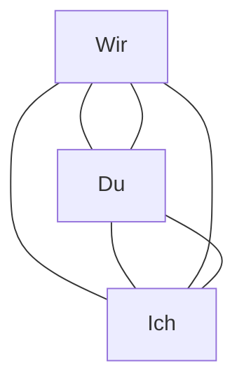

---
title: "Ein Markdwon Beispiel"
author: "Sebastian Sukstorf"
subtitle: "Geschrieben in Obsidian und mit pandoc über MacBook Pro Terminal generiert"
abstract: Meine kleinen Gehversuche zur Anwendung von Markdown in Obsidian und pandoc.
abstract-title: Gehversuche mit Markdown
keyword: Markdown, Beiepiel, Test
subject: Markdown
description: Eine zusammenfassende Betrachtung von Führungskräften aus der deutschen Verwaltung während eines Online Seminars. Mit zwei Absätzen.
bibliography: /Users/sebastiansukstorf/Library/CloudStorage/OneDrive-sebastian-sukstorf/zotero/sukstorf_bib.bib

# Listen {#sec:listen}
Dieser Text soll ein Beispiel sein, um darzustellen, wie einzelne **Markdown Formatierung** dargestellt werden. 
Beispielsweise die folgenden Listen.

## Einfache Liste

1. erster Eintrag
2. zweiter Eintrag
3. dritter Eintrag

## Geschachtelte Listen:

- erster Eintrag
	- erste Einrückung
	- zweite Einrückung
- zweiter Eintrag
- dritter Eintrag

# Linienblöcke

Hier steht ein Gedicht^[in keinster Weise ähnlich wie die Erzählungen bei [@andersch1999]] formatiert mit Linienblöcken \|.

| Der Regenwurm
| hat keine Hände
| und kein Haus.

| Und wenn es regnet
| kommt er raus.

| Frisst schwere Erde
| und genießt es noch
| dann scheißt er's
| wieder aus.

# Zitate und Programmcodes

Ein Text kommt hier mit einem Zitat:

!!! quote 
    Das ist ein Zitat

Das hier ist ein Programmcode:

`programmcode`

# Referenzen 

## Webseiten {#sec:webseiten}

Weiter Informationen auf den folgenden Online-Seiten:

* [Spiegel Online][https://spiegel.de]: Diese Seite sollte jeder informierte Bürger kennen.
* [Bild Online][https://bild.de]: Diese Seite kennen viel zu viele Menschen, und das ist schade.

## Querverweise innerhalb von Markdown-Dokumenten

Querverweise können erzielt werden über: `# Webseiten {#sec:webseiten} mit dem pandoc Filter pandoc crossref`

Im Ergebnis sieht das dann so aus: siehe auch @sec:webseiten oder @sec:listen.

# Bilder

Eingebettet werden die Bilder über einen direkt Link von imgur. Es ist darauf zu achten, dass ein Bild über den `Markdown Link` eingebettet wird. Mir ist noch nicht klar, wie ich das imgur logo auf den Bildern entfernen kann.

## Bild 1

{#fig:sediment}

## Bild 2

{#fig:sipoc}

Bilder können über Links eingebettet werden. Siehe auch @fig:sipoc. 

## Bild 3 mit 

We generate a Mermaid Diagram.

# Fußnoten

Hier wird eine Fußnote eingefügt^[eine Fußnote gibt einen Hinweis auf eine Quelle oder eine Erläuterung, die nicht im Text verbleiben sollte.]

# Results {#sec:results}

Here are my results. I computed them with this formula:

$$ y = mx + b $$ {#eq:line}

I have plotted them in this figure:

{#fig:menschen}

I have also listed some of the points on this line in the following table:

| X | Y |
|---|---|
| 1 | 1 |
| 2 | 2 |
| 3 | 3 |
| 4 | 4 |

Table: Results related to my line. {#tbl:line}

That was truly amazing here @sec:results.
In @sec:listen und @sec:webseiten, we saw all there was to see about lines.
First, in Equation @eq:line, we saw the deep Maths behind a line.
Second, we saw the most beautiful depiction of a line (@fig:menschen).
Third, @tbl:line presented us, in all their glory, points to a line.

# Glossar

ERZÄHLUNG
:    Eine Erzählung stellt eine Figur oder ein Ereignis in den Mittelpunkt eines Textes.

GEDICHT
:    Ein Gedicht ist eine sinnvoller oder auch sinnfreier Text in einer metrischen Versform über mehrere Strophen.

SIPOC
:    Eine SIPOC ist...

# Literaturverzeichnis

<!--- Die folgende Literatur wurde verwendet: --->

